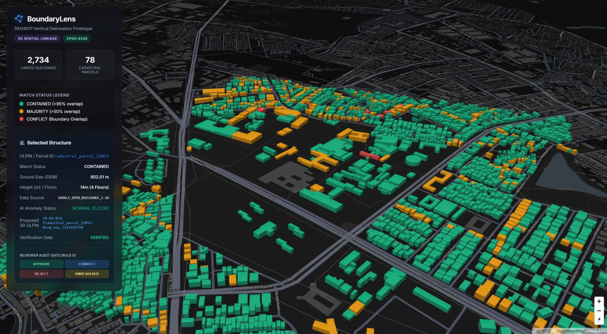

# BoundaryLens: SIH26011 Vertical Delineation Prototype



**BoundaryLens** is a fully functional 3D multi-storey vertical parcel delineation pipeline and interactive Web UI, built specifically for the **Smart India Hackathon 2024 (SIH26011)** problem statement: *"Assigning 3D identities for surface parcels, multi-storey properties and underground infrastructure"*.

This prototype deterministically fuses 2D GIS cadastral layers, satellite-derived multi-storey height constraints, Copernicus DEM terrain elevation, and unsupervised AI anomaly detection to construct **Proposed 3D Vertical ULPINs** without fabricating official government data.

---

## 🎯 Architecture & Implementation Phases
The project is built on a 17-step phase progression, defined strictly by our project constitution `AGENTS.md` and `docs/PHASES.md`. 

| Phase | Description | Key Output / Technology |
| :--- | :--- | :--- |
| **0. Constitution** | Rules of engagement & evidence hierarchy | `AGENTS.md` |
| **1. Data Discovery** | Dataset validation for Bengaluru pilot | OpenCity Cadastral, OSM, Copernicus GLO-30 |
| **2. Ingestion** | Raw data fetching scripts | `scripts/ingestion/` |
| **3. Normalisation** | Uniform CRS standardisation (EPSG:4326/32643) | `GeoPandas` |
| **4. Quality Audit** | Geometric validity checks & cleaning | `Shapely` |
| **5. 2D Spatial Match** | Topological parcel-building intersection | `match_status_2d` (CONTAINED, MAJORITY, CONFLICT) |
| **6. Elevation (DEM)**| Sampling terrain for base ground elevation | `rasterio` (Copernicus DEM) |
| **7. 3D Reconstruction**| Extruding 2D polygons to 3D volumes | `MapLibre GL JS` |
| **8. Real Floor Evidence**| Satellite ML Heights (Google Open Buildings 2.5D) | `floor_entities.json` (8,800+ discrete floors) |
| **9. AI Assistance** | 4D Unsupervised anomaly detection | `scikit-learn` Isolation Forest |
| **10. Fusion Engine** | Deterministic evidence ledger | `evidence_fusion_ledger.json` |
| **11-12. Provenance** | Immutable audit tracking on every output field | Integrated into Phase 10 |
| **13. Human Review** | Interactive reviewer gate in the Web UI | `APPROVE`, `CORRECT`, `REJECT` action logs |
| **14. 3D Vertical ULPINs**| Hierarchical proposed identifiers | `IN-KA-BLR-P78-B12-F3` |
| **15. 3D Web UI** | Glassmorphic, hardware-accelerated frontend | Vanilla HTML/CSS/JS + MapLibre GL |
| **16. SIH Audit** | Final adversarial requirements check | `docs/SIH_AUDIT_VERIFICATION.md` |

---

## ⚙️ How to Reproduce & Run the Pipeline

The entire system is modular, deterministic, and can be reproduced on any local environment.

### 1. Prerequisites
- **Python 3.10+**
- Git

### 2. Setup the Environment
Clone the repository and set up a Python virtual environment:

```bash
git clone https://github.com/NeelakshSaxena/BoundaryLens.git
cd BoundaryLens

# Create and activate virtual environment
python -m venv venv

# Windows
.\venv\Scripts\activate
# Mac/Linux
source venv/bin/activate
```

### 3. Install Requirements
If a `requirements.txt` is missing or out of date, you can generate/update it at any time using:
```bash
pip freeze > requirements.txt
```
To install the exact dependencies used for this pipeline:
```bash
pip install -r requirements.txt
```
*(Key dependencies: `geopandas`, `shapely`, `rasterio`, `scikit-learn`, `numpy`, `requests`)*

### 4. Run the Master Pipeline
We have provided a unified runner script that automatically executes Phases 1 through 14 in the exact required sequence and subsequently launches the Phase 15 Web UI server.

Execute the following command in your terminal:
```bash
python run_pipeline.py
```

> **Bare-earth DEM without an API key:** for reproducible local/hackathon runs,
> place a bare-earth DEM GeoTIFF at `data/raw/dem/bare_earth_dem.tif`. It must
> cover the Bengaluru AOI (W,S,E,N = `77.61365, 12.92365, 77.62635, 12.93635`).
> When present it is validated and used directly and **OpenTopography is not
> contacted**; otherwise the pipeline falls back to the OpenTopography download
> (which needs an `OPEN_TOPOGRAPHY_API` key). See
> [`docs/DATA_SOURCES.md`](docs/DATA_SOURCES.md) → *Local bare-earth DEM*.

**What the pipeline runner does:**
1. Ingests all raw AOI data (OSM, Cadastral, DEM).
2. Cleans, normalizes CRS, and fixes invalid geometries.
3. Performs 2D intersection matching.
4. Samples terrain elevation and allocates discrete floor entities using satellite AI profiles.
5. Runs the `scikit-learn` Isolation Forest to detect overlaps and anomalies.
6. Fuses the evidence ledger and routes conflicts to `HUMAN_VERIFICATION_REQUIRED`.
7. Generates Proposed 3D Vertical ULPIN tags.
8. **Starts a local HTTP server at `http://localhost:8000`** pointing to the `frontend/` Web UI.

### 5. Using the 3D Web Application
Once the pipeline finishes and the server starts:
1. Open **[http://localhost:8000](http://localhost:8000)** in your browser.
2. The UI will render a 3D extrusion map of Bengaluru Urban.
3. Click any building to view its Property Card, containing:
   - Ground Elevation (DEM)
   - Real Floor Counts & Height
   - AI Anomaly Score
   - Proposed 3D Vertical ULPIN
   - Final Verification Gate Status
4. Use the **Reviewer Audit Gate** buttons (`APPROVE`, `CORRECT`, `REJECT`) at the bottom of the sidebar to simulate human adjudication of AI-detected boundary conflicts.

---

## 📄 Licensing & Data Sources
- **Cadastral Maps**: OpenCity GIS Data (Creative Commons)
- **Building Footprints**: OpenStreetMap (ODbL)
- **Terrain Elevation**: Copernicus GLO-30 DEM (Open Access)
- **Height Estimates**: Google Open Buildings 2.5D Temporal Dataset
- **Vegetation Evidence (NDVI)**: Copernicus Sentinel-2 L2A via the public earth-search STAC / AWS Open Data mirror — free and open, *"Contains modified Copernicus Sentinel data"*. Added as an independent evidence layer (Phase 11)
  to test whether an elevation-derived building height may be vegetation rather
  than structure. See [`docs/NDVI_VEGETATION_EVIDENCE.md`](docs/NDVI_VEGETATION_EVIDENCE.md).
  NDVI is vegetation evidence only — **not** a building-vs-tree classifier.

*Prototype designed for the Smart India Hackathon (SIH 2024). Proposed Vertical ULPINs are for demonstration purposes only and do not represent legally binding identity issuance.*
